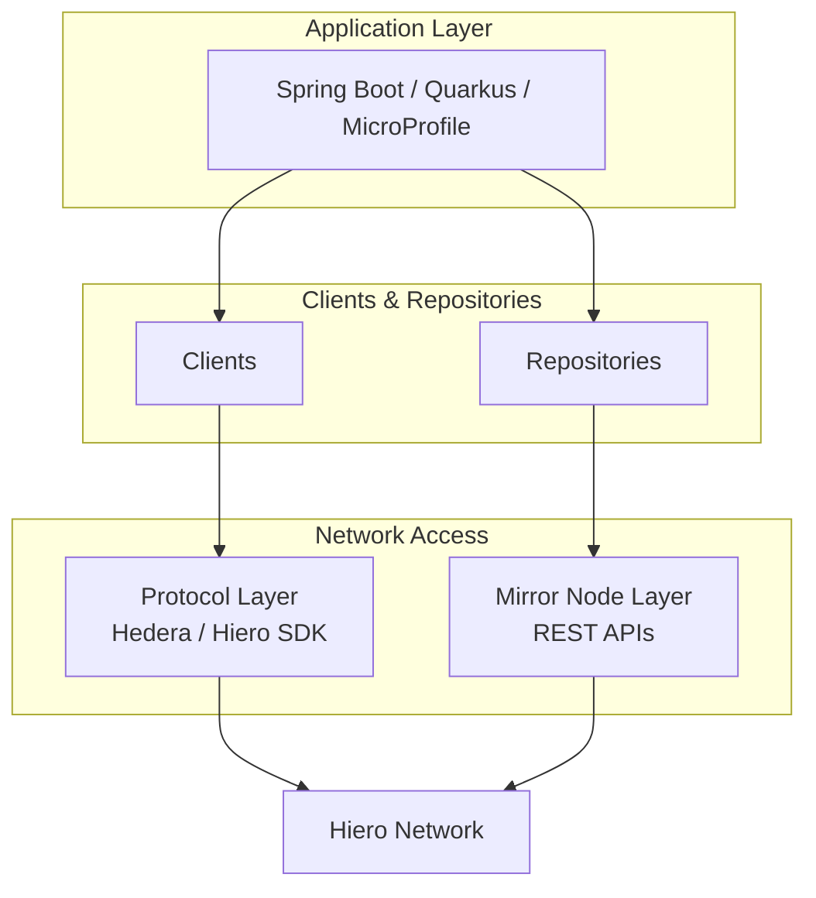
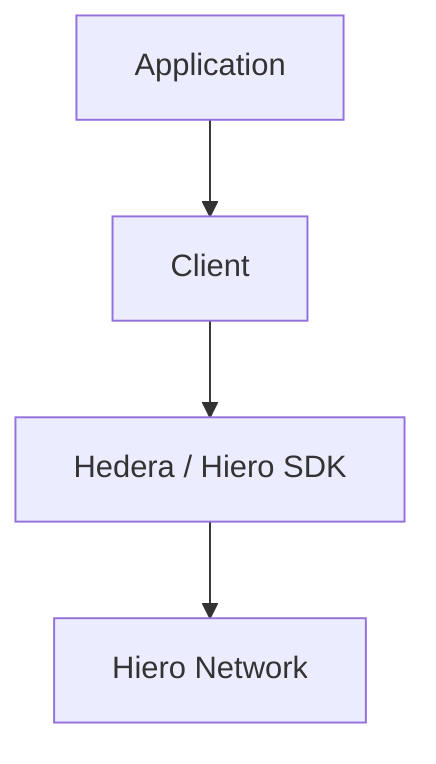
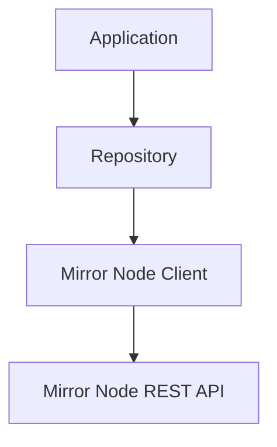

# Architecture

Hiero Enterprise Java provides a framework-agnostic abstraction layer for building applications on the Hiero network. It offers a consistent set of clients, repositories, and data models that can be used across different Java runtimes while hiding most of the underlying SDK and mirror node complexity.

The project is organized into three modules:

| Module | Purpose |
|:--------|:--------|
| `hiero-enterprise-base` | Core APIs, service contracts, data models, and shared implementations. |
| `hiero-enterprise-spring` | Spring Boot integration, configuration, and dependency injection support. |
| `hiero-enterprise-microprofile` | Eclipse MicroProfile and Quarkus integration with CDI support. |

---

## Architecture Overview



---

## Module Responsibilities

### Base Module

The `hiero-enterprise-base` module contains the core APIs and shared implementations used throughout the project.

Key responsibilities include:

- Transaction clients for protocol-layer operations
- Repository interfaces for mirror-node queries
- Shared domain models and DTOs
- Configuration abstractions
- Common service implementations
- Contract verification support

Core abstractions include:

- `HieroConfig`
- `HieroContext`
- Client interfaces
- Repository interfaces
- Domain data models

This module contains no framework-specific code and can be used directly in custom integrations.

---

### Spring Boot Module

The `hiero-enterprise-spring` module provides seamless integration with Spring Boot applications.

Features include:

- `@EnableHiero` auto-configuration
- Configuration properties under `spring.hiero.*`
- Spring-managed service beans
- Automatic dependency injection
- Spring-specific REST and JSON implementations

Typical usage:

```java
@Service
public class TokenService {

    private final FungibleTokenClient tokenClient;

    public TokenService(
        FungibleTokenClient tokenClient
    ) {
        this.tokenClient = tokenClient;
    }
}
```

Applications using Spring Boot typically depend only on this module.

---

### MicroProfile Module

The `hiero-enterprise-microprofile` module provides integration for Eclipse MicroProfile runtimes such as Quarkus.

Features include:

- CDI-managed beans
- Producer-based service registration
- Configuration properties under `hiero.*`
- MicroProfile-specific REST and JSON implementations

Typical usage:

```java
@ApplicationScoped
public class TokenService {

    @Inject
    FungibleTokenClient tokenClient;
}
```

This module exposes the same service interfaces available in the base module.

---

## Core Components

### Clients

Clients are responsible for submitting transactions and performing state-changing operations on the network.

Examples:

- `AccountClient`
- `FileClient`
- `TopicClient`
- `FungibleTokenClient`
- `NftClient`
- `SmartContractClient`
- `ContractVerificationClient`

Typical operations include:

- Creating accounts
- Creating and transferring tokens
- Publishing topic messages
- Deploying smart contracts
- Executing contract functions

---

### Repositories

Repositories provide read-only access to network data through mirror nodes.

Examples:

- `AccountRepository`
- `FileRepository`
- `TopicRepository`
- `FungibleTokenRepository`
- `NftRepository`
- `SmartContractRepository`

Typical operations include:

- Looking up accounts
- Querying token balances
- Reading topic messages
- Retrieving NFT information
- Fetching contract details

Repositories never submit transactions.

---

## Network Interaction Paths

Hiero Enterprise Java separates write operations from read operations.

### Transaction Path

Used when submitting transactions to the network.



Examples:

- Account creation
- Token minting
- Topic message submission
- Smart contract deployment

---

### Query Path

Used for retrieving network data.


Examples:

- Account lookups
- Transaction history
- Token information
- Topic messages
- NFT metadata

---

## External Dependencies

Hiero Enterprise Java currently builds on top of:

- Hedera Java SDK
- Spring Boot (optional)
- Eclipse MicroProfile / Quarkus (optional)

---

## Next Steps

- [Getting Started](getting-started.md) – Configure and connect to a Hiero network.
- [Spring Boot Integration](spring-boot.md) – Enable Hiero services in Spring applications.
- [MicroProfile Integration](microprofile.md) – Configure Hiero services with CDI and MicroProfile.
- [Clients & Repositories](client-and-repository.md) – Explore the available managed services.